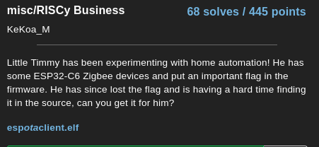
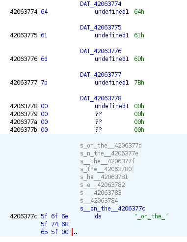
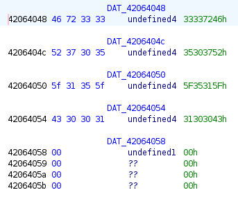

# Misc - RISCy Business
- Flag: dam{Fr33R705_15_C001_on_the_esp32c6}

## Writeup

Here is the challenge description:



I looked into the strings of the file to and filtered for "flag" to see if I find anything:
```shell-session
$ strings esp_ota_client.elf | grep -i flag
...SNIP...
xPortSwitchFlag
spi_flash_set_erasing_flag
phy_get_modem_flag
build_flag_task
```

The last one `build_flag_task` seems like a potential starting point.

I opened the file in ghidra and let it analyse the file. I then searched for `build_flag_task` function. Here is the decompiled code:

```c
void build_flag_task(void)

{
  undefined uVar1;
  undefined uVar2;
  undefined uVar3;
  undefined uVar4;
  char cVar5;
  char cVar6;
  char cVar7;
  char cVar8;
  char cVar9;
  char cVar10;
  char cVar11;
  char cVar12;
  undefined uVar13;
  undefined uVar14;
  undefined uVar15;
  undefined4 uVar16;
  undefined *__ptr;
  int iVar17;
  char *pcVar18;
  undefined *puVar19;
  
  gp = 0x4080fb94;
  uVar16 = esp_log_timestamp();
  esp_log(3,s_ESP_OTA_CLIENT_42063488,s_I_(%lu)_%s:_Waiting_for_Zigbee_n_42063708,uVar16,
          s_ESP_OTA_CLIENT_42063488);
  xEventGroupWaitBits(zigbee_event_group_flag,1,1,0xffffffff);
  __ptr = (undefined *)malloc(0x26);
  if (__ptr == (undefined *)0x0) {
    puts(s_Memory_allocation_failed_42063740);
    vTaskDelete(0);
  }
  iVar17 = xQueueSemaphoreTake(xStringMutex,0xffffffff);
  if (iVar17 != 0) {
    printf(s_Task_2_received:_%s_4206375c,&sharedString);
    xQueueGenericSend(xStringMutex,0,0,0);
    uVar4 = DAT_42063778;
    uVar3 = DAT_42063777;
    uVar2 = DAT_42063776;
    uVar1 = DAT_42063775;
    *__ptr = DAT_42063774;
    __ptr[1] = uVar1;
    __ptr[2] = uVar2;
    __ptr[3] = uVar3;
    __ptr[4] = uVar4;
    strcat(__ptr,&sharedString);
    iVar17 = strlen(__ptr);
    cVar12 = s__on_the__4206377c[8];
    cVar11 = s__on_the__4206377c[7];
    cVar10 = s__on_the__4206377c[6];
    cVar9 = s__on_the__4206377c[5];
    cVar8 = s__on_the__4206377c[4];
    cVar7 = s__on_the__4206377c[3];
    cVar6 = s__on_the__4206377c[2];
    cVar5 = s__on_the__4206377c[1];
    pcVar18 = __ptr + iVar17;
    *pcVar18 = s__on_the__4206377c[0];
    pcVar18[1] = cVar5;
    pcVar18[2] = cVar6;
    pcVar18[3] = cVar7;
    pcVar18[4] = cVar8;
    pcVar18[5] = cVar9;
    pcVar18[6] = cVar10;
    pcVar18[7] = cVar11;
    pcVar18[8] = cVar12;
    iVar17 = strlen(__ptr);
    uVar15 = DAT_4206378f;
    uVar14 = DAT_4206378e;
    uVar13 = DAT_4206378d;
    uVar4 = DAT_4206378c;
    uVar3 = DAT_4206378b;
    uVar2 = DAT_4206378a;
    uVar1 = DAT_42063789;
    puVar19 = __ptr + iVar17;
    *puVar19 = DAT_42063788;
    puVar19[1] = uVar1;
    puVar19[2] = uVar2;
    puVar19[3] = uVar3;
    puVar19[4] = uVar4;
    puVar19[5] = uVar13;
    puVar19[6] = uVar14;
    puVar19[7] = uVar15;
    iVar17 = strlen(__ptr);
    __ptr[iVar17] = 0x7d;
    (__ptr + iVar17)[1] = 0;
  }
  uVar16 = esp_log_timestamp();
  esp_log(3,s_ESP_OTA_CLIENT_42063488,s_I_(%lu)_%s:_Flag:_%s_42063790,uVar16,
          s_ESP_OTA_CLIENT_42063488,__ptr);
  cfree(__ptr);
  vTaskDelete(0);
  return;
}
```

I didn't really understood what it does as I am still learning C so I can only make inferences.

So I assume that it builds the flag based on a zigbee event.

I then looked through the multiple `DAT_*`s and noticed that some of them have a value in hex



With this, I attempted to reconstruct it from `0x42063774` to `0x4296378f`.

Here is the string when decoded:  `dam{_on_the_esp32c6`

The flag looks incomplete at the start and I assumed we can just close the flag at the end. I decided to look into the code more and found that there is a value called `sharedString` in the decompiled code.

I went to its location and found that it is being XREF by `esp_zb_app_signal_handler`. Going to the function, I see the following snippet of code:

```c
    sharedString = DAT_42064048;
    DAT_40811f60 = DAT_4206404c;
    DAT_40811f64 = DAT_42064050;
    DAT_40811f68 = DAT_42064054;
    DAT_40811f6c = DAT_42064058;
    xQueueGenericSend(xStringMutex,0,0,0);
    return;
```

Going to `0x42064048` we see the following:



I then took all the hex value and decoded them and got this: `Fr33R705_15_C001`

With this, I assembled everything and got the flag: `dam{Fr33R705_15_C001_on_the_esp32c6}`.