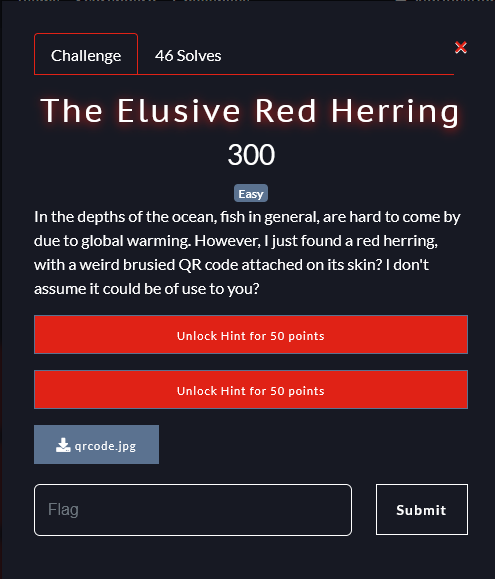
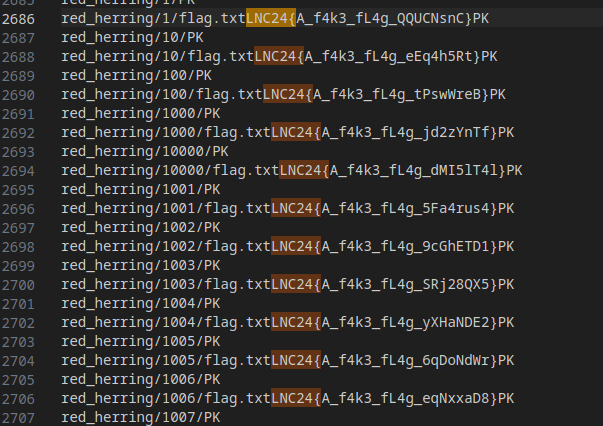
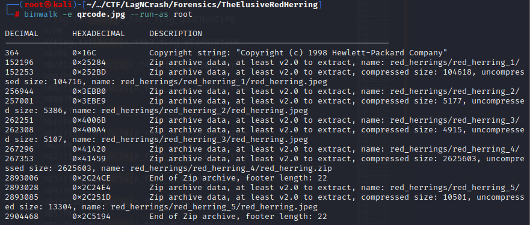
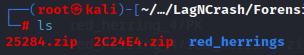
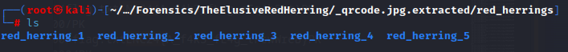
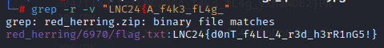

+++
date = '2024-03-22T22:49:53+08:00'
draft = false
title = 'The Elusive Red Herring'
url = 'the-elusive-red-herring'
+++

# Lag and Crash 2024

## Forensics - The Elusive Red Herring
Flag: LNC24{d0nT_f4LL_4_r3d_h3rR1nG5!}

## Write Up
This is the challenge:

Installing the JPG file, this is what we see:

Doing `strings qrcode.jpg >> output.txt` and opening VSCode, we decided to search for LNC24{ and find this:

We find just a bunch of fake flags.

Next, we decided to do binwalk on the image to see if there is anything we can extract, and we did!

We looked inside what we extracted and found 2 zip files and 1 directory:

This is inside the 'red_herrings' directory:

Inside 1, 2, 3 and 5 are just images, but within 4 was a zip file that we decided to extract.

After extracting that file, a bunch of 'flag.txt' files were extracted.

So we decided to use this grep command: `grep -r -v "LNC24{A_f4k3_fL4g_"`

And we got the flag!