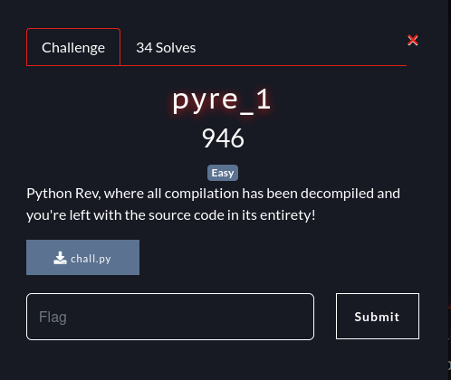
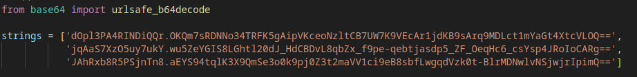
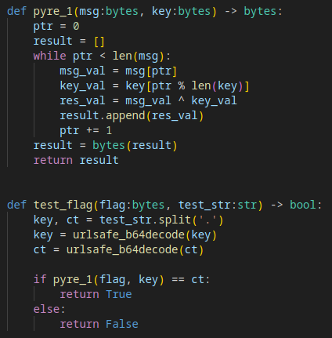
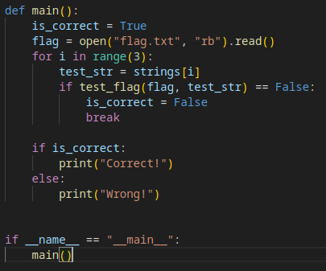
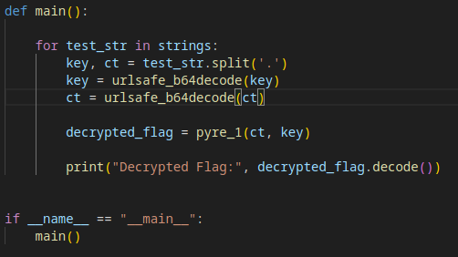
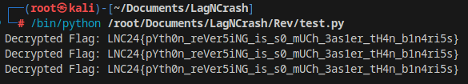

+++
date = '2025-03-05T22:49:53+08:00'
draft = false
title = 'pyre_1'
url = 'ctf/pyre-1'
+++

# Lag and Crash 2024

## Reverse Engineering - pyre_1
Flag: LNC24{pYth0n_reVer5iNG_is_s0_mUCh_3as1er_tH4n_b1n4ri5s}

## Write Up
This is the challenge:

So we download the python file and review the code.

We find that there are some strings thatt seems to be in base64 encoded:

After that, we look at the other functions:

What 'pyre_1' basically does is that it takes in to parameters as bytes, and returns them as bytes. The function performs a simple XOR operation between 'msg' and 'key'.

As for the 'test_flag' function, it takes in to parameters, 'flag' as bytes and 'test_str' as a string. What it does is that is basically splits the 'test_str' into 'key' and 'ct' and decodes them using 'urlsafe_b64decode'. It then compares it with the results of 'pyre_1' function with the decoded 'ct'.

The main function is just to run the entire code:

So in order to solve this challenge, I modified the main function:

All I did was simply take the function of 'test_flag', and placed it inside of the main function, and added a for loop to decode each string in 'strings', and then print out the flag.

This is the output we get running the program:

And we got the flag!