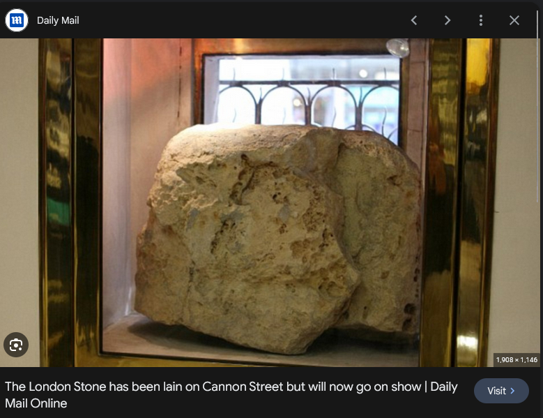
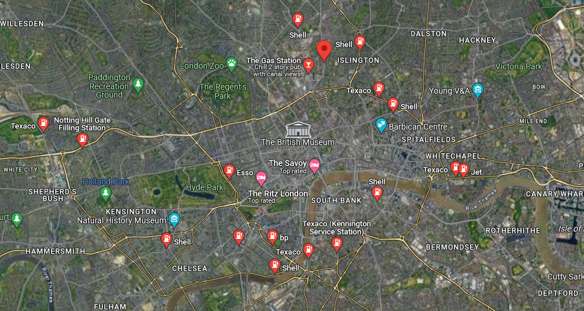

+++
date = '2023-12-13T22:49:53+08:00'
draft = false
title = 'Relic Race'
url = 'ctf/osint-RelicRace'
+++

# STANDCON 2023

## OSINT - Relic Race
- Flag: STANDCON{N4 2AW}

## Writeup
Note: The flag will be in STANDCON{} format with a postal code as the answer

Looking at the image that was given:

If we read the email seen in the image, it can tell us a few things:

- We are sent an airticket
- There is an image of 2 landmarks, a gas station and a bank (target location)

Let's look at the barcode that we can see in the image:

Using pageloot.com/barcode-scanner/, we can see what is inside, and we get the following:

From what we got, we can assume that this is the airticket mentioned in the email.
With this, we can make some assumptions about the location.

"SINLHRBN" basically represents Singapore (SIN) to London Heathrow (LHR). From this information, we can guess that the image could likely be in London, United Kingdom.

Let's look at the photo provided in the image:

From the assumption that this image could be in London, I searched up on Google Images "big stone in london".

After doing this search, I find a rock that looks similar to the glitched rock image:

We then visit this page:

From here, we found out that this rock is known as the "London Stone" and that it is located at Cannon Street in London.

But before that, we searched up what the London Stone is and we found this on Google Images:

Looks familiar? We have found the photo of the glitched out rock, and we have confirmed that this rock is in Cannon Street in London.

Let's now turn to Google Maps and look for the location:

Here we are at Cannon Street, first look, not much greenery as opposed to the image of the location. Let's zoom out and filter out gas stations in London by searching "gas stations London":

I zoomed out a bit to see the whole of London and search for gas stations. If you noticed, there are a lot of gas stations to search for. One thing about searching "gas stations London" is that it won't show all gas stations in London. So to make our search easier, we will be filtering by brands.

I have filtered out all Shell gas stations in London, now it is just looking for the gas station landmark to find our location. To narrow our search even more, I will only be looking at gas stations near greenery as the image shown in the email, the gas station was near some trees and grass:

Once you do some searching, you will realize that Shell gas stations are not it, so let's try Texaco.

If you noticed, there is a gas station here:

Let's give it a look!

This is what we found:

Looks familiar? We have found the location in the photo!

Now, we check the postal code of the bank, we get our flag!

So our flag would be: STANDCON{N4 2AW}