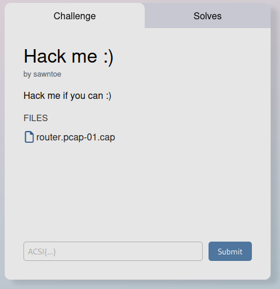
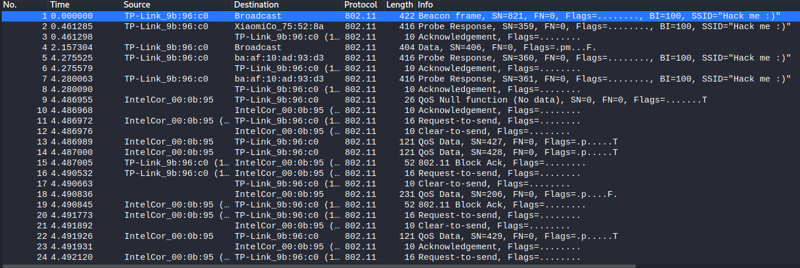
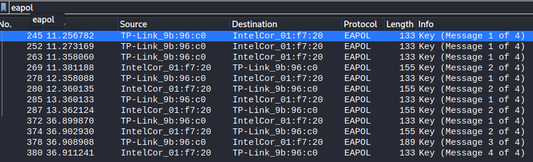
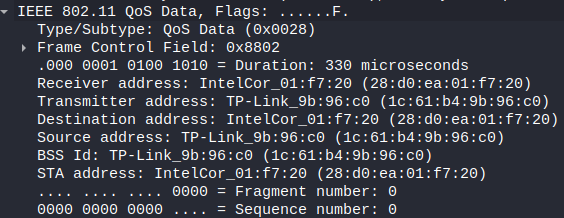
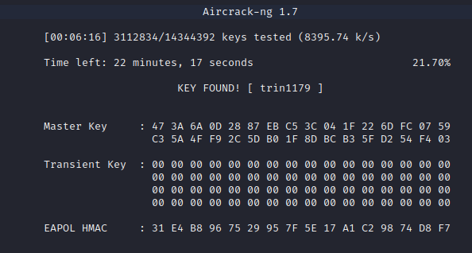
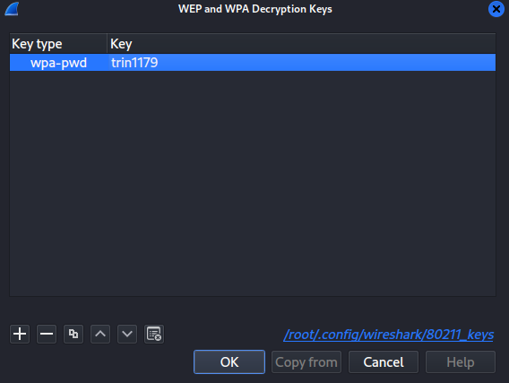
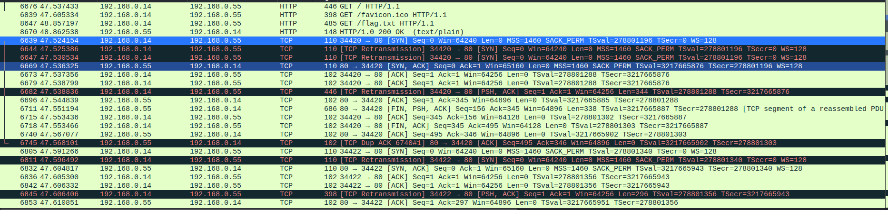
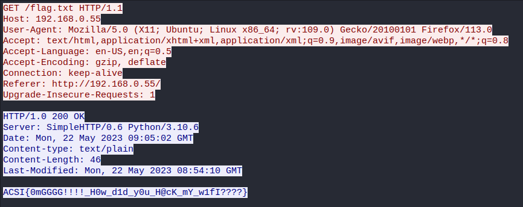

+++
date = '2025-03-05T22:49:53+08:00'
draft = false
title = 'hack me'
+++

# Forensics - Hack Me :)
- Flag: ACSI{0mGGGG!!!!_H0w_d1d_y0u_H@cK_mY_w1fI????}

## Writeup
This is the challenge:

Let's look at the file in Wireshark. This is what we see:

Let us filter by EAPOL to see if we can find any handshakes.
This is what we find:

From here, we are gonna try to crack the key using aircrack and the MAC Address of TP-Link:

Using rockyou.txt as a wordlist, this is the result of the brute force:

Using this key, we right-click on any packet with 802.11 protocol, and we go to Protocol Preferences -> IEEE 802.11 Wireless LAN -> Decryption keys and put this key:

From here, I decided to filter by tcp and this is what we find:

We see that there is an HTTP GET for flag.txt, I will follow this HTTP stream and this is what we get:

And there you have it, we got the flag: ACSI{0mGGGG!!!!_H0w_d1d_y0u_H@cK_mY_w1fI????}