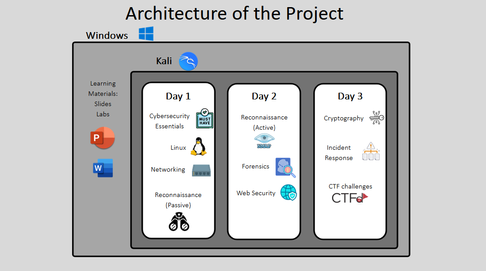

+++
date = '2024-09-03T22:49:53+08:00'
draft = false
title = 'Final Year Project at Temasek Polytechnic'
url = 'projects/fyps'
+++

## Overview
For my final year project, my group was given a task to work on YCEP 2025

Youth Cyber Exploration Programme (YCEP) was a programme started by CSA and hosted by the 5 polytechnics in Singapore. It is a bootcamp that aims to get students in pre-tertiary education excited about their journey towards a career in cybersecurity.

As a group, we organised what we would want to be taught for YCEP 2025 and how the curriculum would play out during the 3 day bootcamp at TP.

My part in the project is to create learning materials and CTF challenges for participants for reconnaissance (information gathering and OSINT) and Incident response. I also prepared and setup the Kali virtual environment for participants to use, and 4 simple reverse engineering challenges.

*Architecture of the Project*

## The Project

Click [here](https://youtu.be/spiA26b6Ff0) for a demo of the Kali VM that I setup and the lab activity for reconnaissance that I designed.

Click [here](https://drive.google.com/drive/folders/1Q-DtNAbLgTR_b3vDK5SC6SiGbyXbOMlM?usp=drive_link) for all the contents that I have worked on.